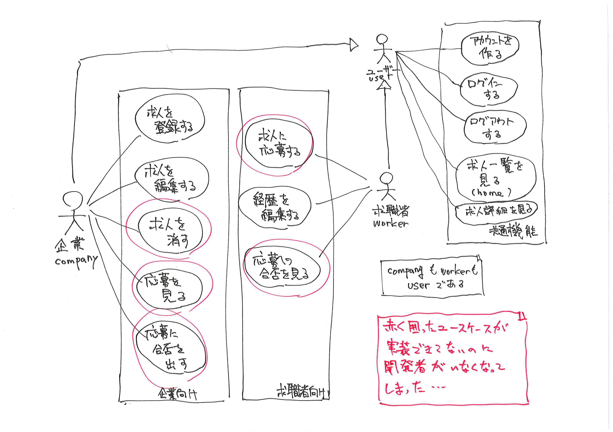
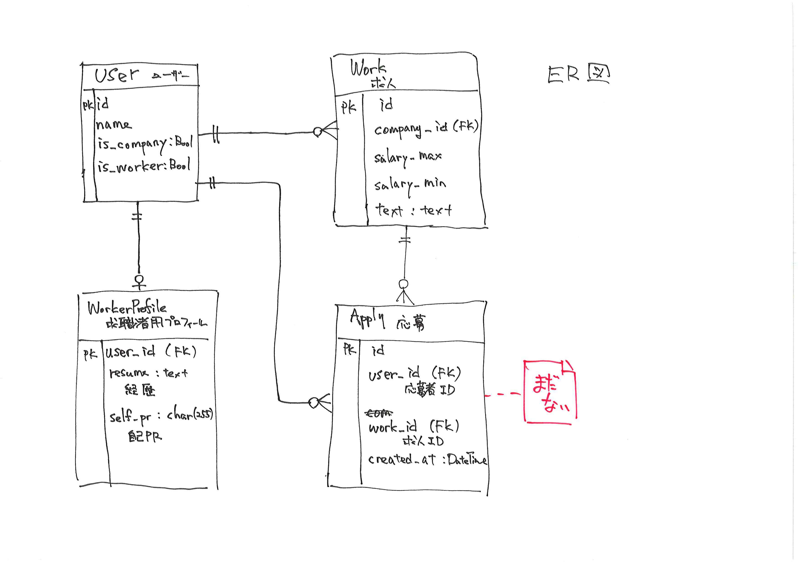

# microhr
エン・ジャパン デジタルプロダクト開発本部 エンジニアインターンシップ課題。

小さな求人サービスを作っていたけれど、開発者が抜けてしまった。後を引き継いで、できてない機能を作ろう！

## できてる機能

### 共通
- アカウントを作る(サインアップ)
- ログインする
- ログアウトする
- 求人一覧を見る(HOME画面)
- 求人詳細を見る

### 企業向け
- 求人を登録する
- 求人を編集する

### 求職者向け
- 経歴を編集する

## できてない機能
### 企業向け
- 求人を削除する
- 応募を見る
- 応募に合否を出す

### 求職者向け
- 求人に応募する
- 応募への合否を見る

## 設計情報
- Djangoを使ったPythonのWebアプリケーションとして作られているようだ。
- Pythonは3.9を使っているようだ。
- DBは現状、SQLite3を使っているらしい。いずれMySQLあたりに置きかえるべきだろう。
- ER図が残っていた。Applyテーブルはまだコードには存在しないようだ。足りないフィールドもありそうだが上手く設計して作り進めて欲しい。

- テストコードが全然ない。適切に書いてくれたら好評価間違いなしです。

## ディレクトリ構成
全体が `internship` いうDjangoプロジェクトのようだ。
その中に ユーザーアカウントの定義やそのための認証機能を受け持つ`accounts` アプリケーションと、求人サイトとしての機能である `microhr` アプリケーションの二つが入っている構成になっている。

どうやらこのようなファイル配置になっているようだ。

- accounts/ ユーザー定義と認証機能
    - forms.py
    - models.py
    - urls.py `accounts/` 以下のURL設定
    - views.py
- documents/ ドキュメントフォルダ
- internship/ Djangoプロジェクトディレクトリ
    - settings.py プロジェクト設定
    - urls.py サイト全体のURL設定
- microhr/ 求人に関する機能
    - static/ CSSなど。
    - templates/ テンプレート。MVTのT
    - urls/ URL設定
    - views/ ビュー MVTのV
    - decorations.py デコレーターをいくつか定義している
    - forms.py フォーム定義
    - models.py 求人についてのモデル定義
- templates/ サイト全体で使用するテンプレート
- manage.py
- README.md
- requirements.txt 依存するPythonモジュールを管理するファイル

## やってほしいこと
- できてない機能を作ってください。
- コード規約は[PEP8](https://pep8-ja.readthedocs.io/ja/latest/)に準拠してください。
- Python/Djangoより、得意な開発言語、開発技術があるなら、このコードのことは気にせず、それを使って0から作り直してもらっても構わない。同じような機能になっていれば、完全に再現しなくても構わない。
- 完成したら、PythonAnywhere などの環境にデプロイして、先輩社員にデモをしてください。
- あっという間にできあがってしまい、時間が大幅に余るようであれば、求人サイトを作り続けてきた先輩社員と相談して、「求人サイトに足らないと思う機能」を作り足してみて欲しい。

### 環境構築
1. `en-japan-internship/internship` レポジトリを自分用にcloneしてください。読み取る権限を設定してあります。
2. `en-japan-internship/internship-[卒業年度]-[githubアカウント名]` でレポジトリを作成してあります。そこを自分が開発するためのレポジトリとして使ってください。こんな感じでpushすることになるはずです。
    ```
    $ git remote add myrepo git@github.com:en-japan-internship/internship-[卒業年度]-[githubアカウント名].git
    $ git branch -M main
    $ git push -u myrepo main
    ```

3. まずcloneしてきたコードを手元で動かせる環境を作る。
    - pythonは3.9を推奨しています。自身のPCに入っていて、研究などに使っているPythonが異なるバージョンの場合は、pyenv や virtual envなどを上手く使って干渉しないようにしてください。
    - `manage.py`があるディレクトリで、以下のコマンドを順に実行すれば、http://localhost:8000/ として立ち上がるはず。
    ```
    $ pip install -r requirements.txt
    $ python manage.py makemigrations
    $ python manage.py migrate
    $ python manage.py runserver
    ```
    - 一度、[Python Anywhere](https://www.pythonanywhere.com/)（または、Herokuなどの類似サービス）にデプロイしてみてください。Django Girlsチュートリアルの[デプロイ](https://tutorial.djangogirls.org/ja/deploy/)の章が助けになるでしょう。  
    Python Anywhereの場合は、無料のBasic Planを使ってもらいますが、既に使っているなどの事情があって、Basic Planを使えない場合は、先輩社員と相談してください。

### 開発の手順
いわゆる[GitHub Flow](https://atmarkit.itmedia.co.jp/ait/articles/1708/01/news015.html)で進めてください。

3. 開発する機能ごとに、自分のレポジトリのmainブランチから機能実装ブランチ(feature ブランチ)を作り、足りない機能を実装してください。手元で動かして動作を確認する場合も、実装ブランチで動かしてください。
5. 機能実装ブランチでの機能開発が終わったら、mainブランチへのPull-Request (P-R)を出して、先輩社員のコードレビューを受けてください。
    - これを見て評価します。
    - インターンシップのメンター担当者をP-Rのレビュー担当者としてアサインしてください。ただし、その他の社員がレビューを行い、コメントを付ける場合もあります。
    - SlackにP-RのURLとともに依頼を投げてください。
    - 一般論として、レビュー指摘は全てが「言われたとおりに修正すればよい」ものではありません。直すべきものを直してください。
    - レビューを受け、社員エンジニアの誰か一人がapproveしたブランチは自分のレポジトリのmainブランチにマージしてもらって構いません。ただし、approveした社員以外の指摘にも、対応をお願いします。
6. 最終日までに、作るべき機能がすべて、実装とレビューが完了して、mainブランチにマージされている状態を目指してください。そして、できあがったコードがPythonAnywhere（など）で動くようにしておいてください。最終日にデモをしてもらいます。

## 参考情報
元を作った開発者はこのあたりをみたらしい。参考になるかも知れない。
- [Django Girlsのチュートリアル](https://tutorial.djangogirls.org/ja/)
- [Django 公式チュートリアル](https://docs.djangoproject.com/ja/4.0/)
- [実践Django Pythonによる本格Webアプリケーション開発](https://www.amazon.co.jp/dp/B095BZPJYW/ref=cm_sw_r_tw_dp_86869WS0FE8CTJNX03XG)
- [How to Implement Multiple User Types with Django](https://simpleisbetterthancomplex.com/tutorial/2018/01/18/how-to-implement-multiple-user-types-with-django.html)

## 評価ポイント
- コードが動くものかどうかはもちろん、きれいかどうかも重視します。
- チュートリアルなどを見てそのとおりにやっても、バージョンが変わったりしていてうまく行かない箇所がある。そういう所を上手く切り抜けられるかを評価します。
- 分からないところは先輩社員に聞いてもらって構いません。
    - 自分で調べずにすぐに人に聞くのも、人に聞けずにうまく行かないことを抱え込みすぎるのもよくないので、適度に調べて、適度に人に聞きましょう。
- P-Rが上手く出せるかといったところも見ます。
- コードフォーマットがおかしいところ、名前の付け方がよくないところ、コメントが不適切なところなど *そのまま残っている*。ぜひ直してみよう！
